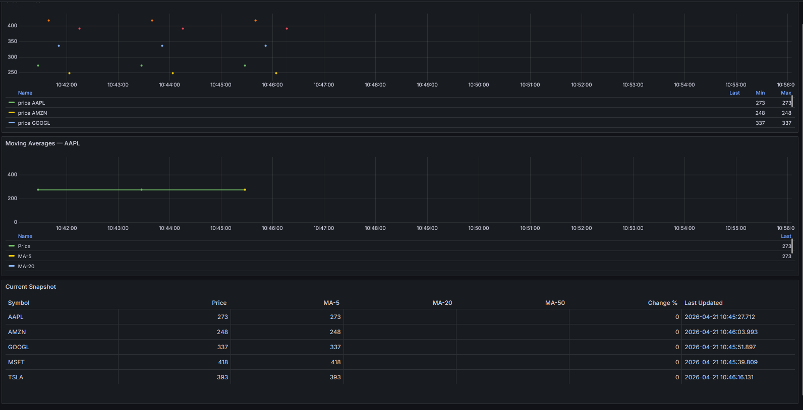

# Real-Time Stock Market Analytics Pipeline

A real-time financial data pipeline built in C# that ingests live stock prices, streams them through Apache Kafka, computes moving averages, stores results in PostgreSQL, and visualizes everything in Grafana.



---

## Architecture

```
Alpha Vantage REST API
        │
        ▼  (every 60s per symbol)
┌─────────────────────┐
│  StockPipeline      │  BackgroundService — polls prices,
│  .Ingestion         │  publishes to Kafka
└─────────────────────┘
        │
        ▼  Kafka topic: stock.quotes.raw
┌─────────────────────┐
│  StockPipeline      │  Kafka consumer — calculates moving
│  .Processor         │  averages, writes to PostgreSQL
└─────────────────────┘
        │
        ▼
┌─────────────────────┐
│    PostgreSQL        │  stock_quotes + moving_averages tables
└─────────────────────┘
        │              │
        ▼              ▼
┌─────────────┐  ┌───────────────┐
│  Grafana    │  │  REST API     │  ASP.NET Core + Swagger UI
│  Dashboard  │  │  (Swagger)    │
└─────────────┘  └───────────────┘
```

---

## Tech Stack

| Component | Technology |
|---|---|
| Data ingestion | C# `BackgroundService` + `HttpClient` |
| Message queue | Apache Kafka (Confluent) |
| Stream processing | C# `Confluent.Kafka` consumer + LINQ windowed aggregation |
| Storage | PostgreSQL + Dapper |
| REST API | ASP.NET Core Web API + Swagger |
| Visualization | Grafana |
| Infrastructure | Docker Compose |

---

## Prerequisites

- [.NET 10 SDK](https://dotnet.microsoft.com/download)
- [Docker Desktop](https://www.docker.com/products/docker-desktop/)
- [Alpha Vantage API key](https://www.alphavantage.co/support/#api-key) (free)

---

## Getting Started

### 1. Clone the repository

```bash
git clone https://github.com/your-username/Real-Time-Stock-Market-Analytics-Pipeline.git
cd Real-Time-Stock-Market-Analytics-Pipeline
```

### 2. Add your Alpha Vantage API key

Edit `src/StockPipeline.Ingestion/appsettings.json`:

```json
{
  "AlphaVantage": {
    "ApiKey": "YOUR_API_KEY_HERE"
  }
}
```

### 3. Start infrastructure

```bash
docker compose up -d
```

This starts Kafka, Zookeeper, PostgreSQL, and Grafana. Wait ~15 seconds for all containers to be healthy.

### 4. Run the services

Open three separate terminals:

```bash
# Terminal 1 — fetches stock prices and publishes to Kafka
dotnet run --project src/StockPipeline.Ingestion

# Terminal 2 — consumes Kafka, calculates moving averages, writes to Postgres
dotnet run --project src/StockPipeline.Processor

# Terminal 3 — REST API
dotnet run --project src/StockPipeline.Api
```

---

## Accessing the Application

| Interface | URL | Credentials |
|---|---|---|
| Grafana Dashboard | http://localhost:3000 | admin / admin |
| Swagger UI | http://localhost:5000/swagger | — |
| PostgreSQL | localhost:5432 | stock / stockpass |

---

## Grafana Dashboard

Navigate to **Dashboards → Real-Time Stock Pipeline**.

| Panel | Description |
|---|---|
| **Stock Prices** | Live time-series of all tracked symbols |
| **Moving Averages — AAPL** | Price overlaid with MA-5, MA-20, MA-50 for AAPL |
| **Current Snapshot** | Table with latest price, all MAs, and % change — color-coded green/red |

The dashboard auto-refreshes every 30 seconds.

---

## REST API Endpoints

| Method | Endpoint | Description |
|---|---|---|
| GET | `/api/stocks/summary` | Latest snapshot for all symbols |
| GET | `/api/stocks/{symbol}/latest` | Latest price and moving averages for one symbol |
| GET | `/api/stocks/{symbol}/history?hours=24` | Historical data for the last N hours |

Example response from `/api/stocks/AAPL/latest`:

```json
{
  "symbol": "AAPL",
  "price": 273.00,
  "ma5": 273.00,
  "ma20": null,
  "ma50": null,
  "price_change_pct": 0.0012,
  "processed_at": "2026-04-21T10:45:27Z"
}
```

> MA-20 and MA-50 populate after 20 and 50 data points are collected respectively.

---

## Database Schema

```sql
-- Raw tick data
stock_quotes (id, symbol, price, open, high, low, volume, timestamp, ingested_at)

-- Processed data with moving averages
moving_averages (id, symbol, timestamp, price, ma_5, ma_20, ma_50, price_change_pct, processed_at)
```

---

## Configuration

### Tracked symbols

Edit `src/StockPipeline.Ingestion/appsettings.json`:

```json
{
  "Symbols": ["AAPL", "MSFT", "GOOGL", "AMZN", "TSLA"],
  "PollIntervalSeconds": 60,
  "SymbolDelaySeconds": 12
}
```

> **Alpha Vantage free tier**: 25 requests/day. With 5 symbols polled every 60s and a 12s delay between each symbol, the pipeline stays within the rate limit. Reduce the symbol list or increase `PollIntervalSeconds` if needed.

### Kafka

Default bootstrap server: `localhost:9092`. Change via `Kafka:BootstrapServers` in each service's `appsettings.json`.

---

## Project Structure

```
├── docker-compose.yml
├── init.sql                          # PostgreSQL schema
├── grafana/
│   └── provisioning/
│       ├── datasources/postgres.yml  # Auto-configured Postgres datasource
│       └── dashboards/               # Auto-provisioned dashboard
└── src/
    ├── StockPipeline.Shared/         # Models, Kafka topics, JSON serializer
    ├── StockPipeline.Ingestion/      # Alpha Vantage poller + Kafka producer
    ├── StockPipeline.Processor/      # Kafka consumer + moving average engine
    └── StockPipeline.Api/            # ASP.NET Core REST API
```

---

## Moving Averages Explained

| Indicator | Window | Signal |
|---|---|---|
| MA-5 | Last 5 data points | Very short-term momentum |
| MA-20 | Last 20 data points | Medium-term trend |
| MA-50 | Last 50 data points | Long-term trend |

A price crossing **above** a moving average indicates upward momentum. A price crossing **below** suggests a potential downtrend — a classic technical analysis signal used in algorithmic trading.
